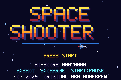
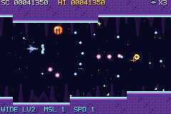
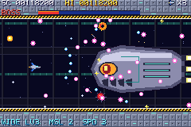

# Space Shooter

An original horizontal shoot-'em-up for the **Game Boy Advance**, built on [Butano](https://github.com/GValiente/butano) and devkitARM. It has three scrolling stages, nine enemy types, capsule power-ups, four weapons, three multi-phase bosses, an ending, and a saved high score. It is designed around real GBA hardware limits: 240×160, 128 sprites, 32 KB OBJ VRAM, fixed-point math, no heap during gameplay.

  

Output: **`spaceshooter.gba`** (≈ 323 KB) in the repository root.

## Controls

| Button | Action |
|---|---|
| D-pad | Move (8 directions) |
| A (hold) | Fire (plus homing missiles once collected) |
| B (hold, release) | Charged piercing wave |
| START | Start game / pause / resume |

Gameplay, enemies, weapons and bosses are described in [docs/design.md](docs/design.md).

## Building

### Prerequisites (Windows, native, no WSL needed)

1. **devkitPro**: run the installer from <https://github.com/devkitPro/installer/releases>, install to `C:\devkitPro`, tick **GBA Development**. Alternatively, from the devkitPro MSYS2 shell: `pacman -S gba-dev`. Tested with devkitARM r68 (GCC 16.1).
2. **Python 3** from python.org (tick "Add to PATH"). The Windows Store `python` alias is not enough; `build.ps1` finds the real interpreter via `py -3`.
3. **Git**, then fetch the Butano submodule (pinned to 21.8.0):
   ```powershell
   git clone --recursive <repo-url>
   # or, in an existing clone:
   git submodule update --init
   ```

### Build

```powershell
.\build.ps1                # release   -> spaceshooter.gba
.\build.ps1 -DebugBuild    # debug     -> spaceshooter_debug.gba
.\build.ps1 -ProfileBuild  # release code + test hooks -> spaceshooter_profile.gba
.\build.ps1 -Run           # build, then open in mGBA
.\build.ps1 -Clean
```

The makefiles cannot handle paths containing spaces. `build.ps1` therefore maps the repository to a free drive letter with `subst` for the duration of the build, so the repo can live anywhere.

### Linux / macOS / MSYS2 shell

Install devkitPro pacman and `gba-dev`, set `DEVKITPRO`/`DEVKITARM`, clone into a path **without spaces**, then:

```sh
./build.sh          # or: make -j$(nproc)
make DEBUG=1        # debug ROM
```

### Asset pipeline

Every graphic and sound is generated from code in `tools/` (Python standard library only): pixel art, palettes, font, backgrounds, MOD music, and WAV effects. The Makefile runs `tools/gen_assets.py` before each build, which writes `assets/generated/` (indexed BMP + JSON, `.mod`, `.wav`). Butano's grit/mmutil then convert those into ROM data. No binary assets are committed. To preview the art as PNG: `py -3 tools/gen_assets.py --preview preview/`.

## Running

Open `spaceshooter.gba` in [mGBA](https://mgba.io) (0.10.5 stable or newer), or any accurate GBA emulator. For real hardware, copy it to a flash cart and select **SRAM** as save type (the high score is stored in 32 KB SRAM).

## Debug build

`spaceshooter_debug.gba` adds:

* **SELECT**: overlay with CPU %, enemy/bullet/shot counts, sprites in use, stage frame
* **L / R** on the title screen: choose the starting stage
* **L + R** in game: skip to the stage boss
* Butano asserts and mGBA log output

None of this is compiled into the release ROM.

## Testing

Automated tests drive the real ROMs in mGBA with Lua scripts. They inject input, read a telemetry block in RAM, and take screenshots. They cover boot, title, controls, pause, collisions, death/respawn/game over, a complete playthrough of all three stages and bosses, the ending, high-score save and reload, and CPU/sprite/VRAM budgets.

```powershell
.\tests\run_all.ps1   # builds all 3 ROMs, runs 5 suites (94 checks)
```

This needs the mGBA **nightly** build (for `--script`) in `tools\emulator\` or `$env:MGBA`. See [docs/testing.md](docs/testing.md) for the checklist and measurements.

## Status

| | |
|---|---|
| Build | PASS (release, debug, profile) |
| Target | Game Boy Advance (ARM7TDMI, Mode 0, 4bpp sprites, Maxmod audio, SRAM save) |
| Frame rate | 59.73 Hz (hardware refresh), 0 missed frames in a full playthrough; average CPU 29 %, worst frame 78 % |
| Tests | 94/94 automated checks passing in mGBA |

### Known limitations

* **Not tested on a physical GBA.** It was tested in mGBA only; see the hardware assessment in docs/testing.md.
* Shield and 1UP pickups are not exercised by the automated bot; they are covered only by code review so far; try them in a manual session.
* Audio is verified by hardware state (Maxmod/Direct Sound running, music start/pause). Its quality has not been judged beyond that. Music is simple 4-channel generated MOD.
* When a pool is full (for example 32 enemy bullets during dense boss phases), new spawns are dropped rather than overwriting anything.
* Only the high score is saved; there is no continue or stage unlock.
* Building requires a path without spaces (handled automatically by `build.ps1` on Windows).
* The automated tests are Windows/PowerShell scripts and open a small mGBA window while running.

## Project layout

```
src/            game code (C++20): app state machine, core/, game/, data/, screens/
tools/          asset sources + generator (Python)
tests/          mGBA Lua tests + PowerShell runners
docs/           research.md, architecture.md, design.md, testing.md
external/butano Butano engine (git submodule, 21.8.0)
```

Architecture: [docs/architecture.md](docs/architecture.md). Research and sources: [docs/research.md](docs/research.md).

## Credits

* Game design, code, pixel art, music and sound: original work for this project (all assets are generated by `tools/`).
* Engine: [Butano](https://github.com/GValiente/butano) by Gustavo Valiente (zlib license); its bundled third-party code is listed in `external/butano/licenses`.
* Audio: Maxmod (devkitPro `maxmod-gba`).
* Toolchain: [devkitPro / devkitARM](https://devkitpro.org).
* Reference documentation: [tonc](https://gbadev.net/tonc/), [GBATEK](https://mgba-emu.github.io/gbatek/), [mGBA](https://mgba.io).
* Inspired by the gameplay structure of classic 16-bit horizontal shooters; no assets, names or layouts from any existing game are used.

## License

Code and generated assets: MIT, see [LICENSE](LICENSE). Butano and its bundled libraries keep their own licenses.
