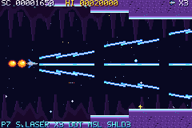
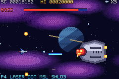

# Space Shooter

An original horizontal shoot-'em-up for the **Game Boy Advance**, written in **C** on [libtonc](https://github.com/devkitPro/libtonc) and Maxmod with devkitARM. It has three scrolling stages, nine enemy types, a 10-step power ladder fed by random capsule drops (lasers, homing weapons, trailing shooters, a periodic shockwave), three multi-phase bosses, an ending, and a saved high score. It is designed around real GBA hardware limits: 240×160, 128 sprites, 32 KB OBJ VRAM, fixed-point math, no heap.

Everything is C: the game, the asset generator that draws every sprite, background, song and sound effect, and the automated test scenarios. The only non-C pieces are a 30-line Lua launcher for the mGBA emulator and the Windows build/test scripts.

   

Output: **`spaceshooter.gba`** (≈ 253 KB) in the repository root. Version **v0.0.1-alpha** (C rewrite; the earlier C++/Butano builds were released as v0.0.1-beta and v0.0.2-beta). Released ROMs are on the [Releases](https://github.com/JeremyNhan/gba-gradius-inspired/releases) page; changes are listed in [CHANGELOG.md](CHANGELOG.md).

## Controls

| Button | Action |
|---|---|
| D-pad | Move (8 directions) |
| A (hold) | Fire (plus homing dots and missiles once earned) |
| B (hold, release) | Charged piercing wave |
| START | Start game / pause / resume |

Destroyed enemies randomly drop **P** capsules. Each one moves you one step up the power ladder:

`normal shot → homing dot → missile → laser → shield → spread laser → shooter → 2 shooters → homing missile → shockwave`

Losing a ship resets you to the normal shot. Gameplay, the power ladder, enemies and bosses are described in [docs/design.md](docs/design.md).

## Building

### Prerequisites (Windows, native, no WSL needed)

1. **devkitPro**: run the installer from <https://github.com/devkitPro/installer/releases>, install to `C:\devkitPro`, tick **GBA Development** (devkitARM, libtonc, Maxmod). Or, from the devkitPro MSYS2 shell: `pacman -S gba-dev`. Tested with devkitARM r68 (GCC 16.1).
2. **Host C compiler** for the asset generator, in the devkitPro MSYS2 shell: `pacman -S gcc`.
3. **Git** to clone the repository. There are no submodules and nothing else to install.

### Build

```powershell
.\build.ps1                # release -> spaceshooter.gba
.\build.ps1 -DebugBuild    # debug   -> spaceshooter_debug.gba
.\build.ps1 -TestBuild     # tests   -> spaceshooter_test.gba (release code + test scenarios)
.\build.ps1 -Run           # build, then open in mGBA
.\build.ps1 -Clean
```

The devkitPro makefiles cannot handle paths containing spaces. `build.ps1` maps the repository to a free drive letter with `subst` for the duration of the build, so the repo can live anywhere.

### Linux / macOS / MSYS2 shell

Install devkitPro pacman and `gba-dev`, set `DEVKITPRO`/`DEVKITARM`, have `gcc` (or `cc`) available, clone into a path **without spaces**, then:

```sh
./build.sh          # or: make -j$(nproc)
./build.sh DEBUG=1  # debug ROM
./build.sh TESTS=1  # test ROM
```

### Asset pipeline

Every graphic and sound is generated by `tools/assetgen/`, a small host C program: pixel-art drawing code, palettes, the font, backgrounds, MOD music and synthesized WAV effects. The Makefile builds it and runs it before each build. It writes `assets/generated/gen_gfx.c` (4bpp tiles, deduplicated background tiles and maps, BGR555 palettes) and `assets/generated/audio/`. Maxmod's `mmutil` then packs the audio into a soundbank. No binary assets are committed. To look at the art: `tools/assetgen/bin/assetgen assets/generated --dump preview/` writes every image as a PGM file of palette indices.

## Running

Open `spaceshooter.gba` in [mGBA](https://mgba.io) (0.10.5 stable or newer), or any accurate GBA emulator. For real hardware, copy it to a flash cart and select **SRAM** as the save type (the high score is stored in 32 KB SRAM).

## Debug build

`spaceshooter_debug.gba` adds:

* **SELECT**: overlay with CPU %, enemy/bullet/shot counts, sprites in use, stage frame
* **L / R** on the title screen: choose the starting stage
* **L + R** in game: skip to the stage boss

None of this is compiled into the release ROM.

## Testing

The test scenarios are C code built into a test ROM. They inject input into the real game, check its state, and write a result log. A 30-line Lua launcher in mGBA saves that log and the requested screenshots. The scenarios cover:

* boot, title, controls, pause and collisions;
* every step of the power ladder and the shockwave;
* death, respawn and game over;
* a complete playthrough of all three stages and bosses to the ending;
* high-score save and reload across an emulator restart;
* CPU and sprite budgets.

```powershell
.\tests\run_tests.ps1   # builds the test ROM, runs 5 suites over two boots (91 checks)
```

This needs the mGBA **nightly** build (for `--script`) in `tools\emulator\` or `$env:MGBA`. See [docs/testing.md](docs/testing.md) for the checklist and measurements.

## Status

| | |
|---|---|
| Build | PASS (release, debug, test; no compiler warnings) |
| Target | Game Boy Advance (ARM7TDMI, Mode 0, 4bpp sprites, Maxmod audio, SRAM save) |
| Frame rate | 59.73 Hz (hardware refresh), 0 missed gameplay frames in a full playthrough; average CPU 29 %, worst frame 74 % |
| Tests | 91/91 automated checks passing in mGBA |

### Known limitations

* **Not tested on a physical GBA.** It was tested in mGBA only; see the hardware assessment in docs/testing.md.
* There is no way to earn extra lives (the power ladder has no 1UP step).
* Balance is untuned by human play: at full power the shockwave (10 % boss HP every 10 s) plus three spread lasers shortens boss fights considerably.
* Audio is verified by hardware state (Maxmod/Direct Sound running, music start/pause). Its quality has not been judged beyond that. Music is simple 4-channel generated MOD.
* When a pool is full (for example 32 enemy bullets during dense boss phases), new spawns are dropped rather than overwriting anything.
* Only the high score is saved; there is no continue or stage unlock.
* Building requires a path without spaces (handled automatically by `build.ps1` on Windows).
* The test runner is a Windows/PowerShell script and opens a small mGBA window while running.

## Project layout

```
src/              game code (C): main loop, state machine, core/ (hardware layer), game/, data/, screens/
src/test/         test driver and scenarios (test ROM only)
tools/assetgen/   asset generator (host C)
tests/            mGBA launcher (Lua) and test runner (PowerShell)
docs/             research.md, architecture.md, design.md, testing.md
```

Architecture: [docs/architecture.md](docs/architecture.md). Research and sources: [docs/research.md](docs/research.md).

## Credits

* Game design, code, pixel art, music and sound: original work for this project (all assets are generated by `tools/assetgen`).
* Libraries: [libtonc](https://github.com/devkitPro/libtonc) (MIT; a few headers derived from libgba carry LGPL notices) and [Maxmod](https://github.com/devkitPro/maxmod) (ISC), both from devkitPro.
* Toolchain: [devkitPro / devkitARM](https://devkitpro.org).
* Reference documentation: [tonc](https://gbadev.net/tonc/), [GBATEK](https://mgba-emu.github.io/gbatek/), [mGBA](https://mgba.io).
* Versions up to v0.0.2-beta were built on [Butano](https://github.com/GValiente/butano) (C++).
* Inspired by the gameplay structure of classic 16-bit horizontal shooters; no assets, names or layouts from any existing game are used.

## License

Code and generated assets: MIT, see [LICENSE](LICENSE). libtonc and Maxmod keep their own licenses.
